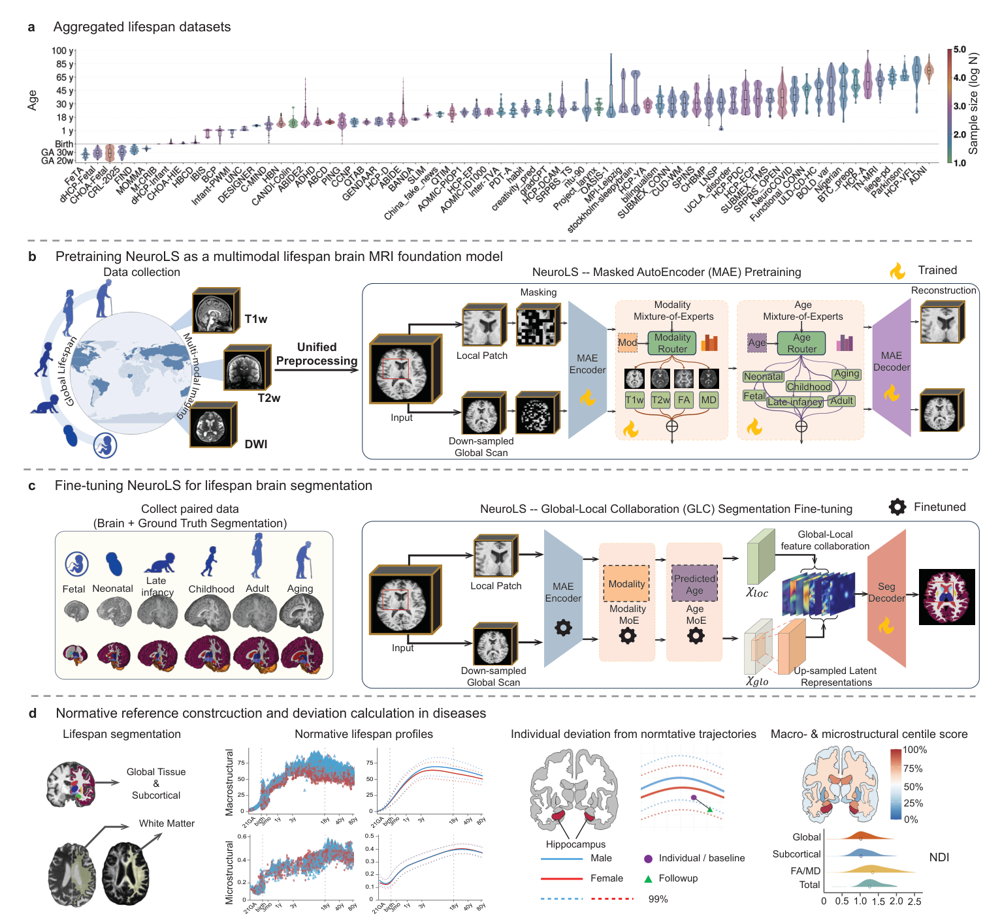

# NeuroLS: Lifespan Brain MRI Segmentation



## Model overview

- **Task**: 15-class brain tissue segmentation (background + 14 labels) across the full lifespan
- **Architecture**: A local encoder with sliding-window patch inference is combined with a global context branch that processes the full-resolution volume. Age group is predicted from the input scan (*fetal / neonatal / infant / child / adult / elderly*) and used to route through modality- and age-specific expert networks in the MoE segmentation head.
- **Modalities**: T1w, T2w, FA, MD

### Output labels

| Label | Region |
|---|---|
| 1 | Ventricles |
| 2 | Gray Matter |
| 3 | White Matter |
| 4 | Hippocampus (bilateral) |
| 5 | Amygdala (bilateral) |
| 6 | Caudate (bilateral) |
| 7 | Putamen (bilateral) |
| 8 | Pallidum (bilateral) |
| 9 | Thalamus (bilateral) |
| 10 | Accumbens (bilateral) |
| 11 | Cerebellum Cortex |
| 12 | Cerebellum White Matter |
| 13 | Brainstem |
| 14 | Ventral Diencephalon (bilateral) |

## Installation

```bash
pip install -r requirements.txt
```

A CUDA-capable GPU is required.

## Checkpoints

Checkpoints are hosted on Hugging Face at [ATHOSD/NeuroLS](https://huggingface.co/ATHOSD/NeuroLS). Download them with:

```bash
pip install huggingface_hub
python -c "
from huggingface_hub import hf_hub_download
hf_hub_download('ATHOSD/NeuroLS', 'checkpoints/age/best_age.pth', local_dir='.')
hf_hub_download('ATHOSD/NeuroLS', 'checkpoints/seg/best_model.pth', local_dir='.')
"
```

Or via the CLI:

```bash
huggingface-cli download ATHOSD/NeuroLS --local-dir .
```

After download the directory should look like:

```
checkpoints/
├── age/best_age.pth
└── seg/best_model.pth
```

## Usage

**Input requirement**: skull-stripped brain MRI in NIfTI format (`.nii` or `.nii.gz`).

### Command line

```bash
CUDA_VISIBLE_DEVICES=0 python pipeline.py /path/to/brain.nii.gz --modality T1w --output_dir ./output
```

**Arguments**:

| Argument | Description | Default |
|---|---|---|
| `input` | Path to skull-stripped NIfTI file | required |
| `--modality` | MRI modality: `T1w`, `T2w`, `FA`, `MD` | `T1w` |
| `--output_dir` | Directory to save outputs | same directory as input |

**Outputs** (saved to `output_dir`):
- `*_preprocessed.nii.gz` — resampled and reoriented scan (1 mm³, RAS)
- `*_seg.nii.gz` — segmentation mask

Volume statistics (mm³ and % ICV) are printed to stdout.

### Python API


```python
from pipeline import LifespanPipeline

pipeline = LifespanPipeline()
result = pipeline.run("brain.nii.gz", modality="T1w", output_dir="./output")

print(result["age_group"])   # e.g. "adult"
print(result["seg_path"])    # path to segmentation mask
print(result["volumes"])     # {"Label_1": 11136.0, "Label_2": 713279.0, ...}
print(result["volumes_pct"]) # {"Label_1": 0.72, "Label_2": 46.24, ...}
```

## Normative Analysis

After running NeuroLS segmentation, the `brainchart/` directory provides R scripts to compute normative centile scores and Normative Deviation Index (NDI) from the volume outputs.

### NN_brainchart (centile scoring and NDI)

**R packages required**: `ggplot2`, `dplyr`, `tidyr`

Scripts and reference data are in `brainchart/`:

| File | Description |
|---|---|
| `NN_brainchart_main.R` | Main script — run this |
| `NN_brainchart_functions.R` | Supporting functions |
| `volume_reference_variables.RData` | Normative centile reference curves |
| `healthy_NDI_reference.RData` | Healthy cohort NDI distribution |
| `disease_age_range_map.RData` | Disease-specific age range definitions |
| `example_clinical_data.RData` | Example input data |

**To run**:

1. Set `output_dir` at the top of `NN_brainchart_main.R` to your output folder.
2. Replace `example_clincial_data_DWS` with your own data frame (columns: `Age`, `Sex`, volume columns matching NeuroLS labels).
3. Run the script:

```r
source("brainchart/NN_brainchart_main.R")
```

**Outputs** (saved to `output_dir`):
- `*_ref.png` — normative centile trajectory plots for each brain region
- `*_<region>.png` — clinical cohort overlaid on normative curves
- `*_median_centile_table.csv` — per-subject median centile score per region
- `*_global_NDI.csv` / `*_subcortical_NDI.csv` — NDI scores
- `*_global_NDI_violin.png` / `*_subcortical_NDI_violin.png` — NDI distribution plots

### Section 3 brainchart scripts

Scripts and data in `brainchart/section3/` provide normative reference model fitting for global/subcortical volumes and DTI (FA, MD).

**R packages required**: `ggplot2`, `gamlss`, `gamlss.dist`

**To run**:

1. Set `tmp_folder` at the top of each script to the `brainchart/section3/` directory path.
2. Run the relevant script:

```r
# Global and subcortical volumes
source("brainchart/section3/brainchart_section3_global_subcortical.R")

# DTI FA/MD
source("brainchart/section3/brainchart_section3_DTI_FA_MD.R")

# Developmental milestones
source("brainchart/section3/brainchart_section3_milestones.R")
```

## Training

Training has two sequential stages: MAE pretraining followed by segmentation fine-tuning. Before running either, edit the relevant config file to set your local paths.

### 1. MAE Pretraining

Edit `cfg/lifespan_mae.yaml` and update:

| Field | Description |
|---|---|
| `system.ckpt_dir` | Directory to save MAE checkpoints |
| `data.mae_root` | Root directory of skull-stripped NIfTI files, organized by dataset/subject |
| `data.mae_domain_file` | Text file listing training domains (one per line) |
| `data.mae_val_domain_file` | Text file listing validation domains |

```bash
CUDA_VISIBLE_DEVICES=0 python train_mae_pretraining.py \
    --config cfg/lifespan_mae.yaml \
    --data_root /path/to/data \
    --output_dir ./MAE_checkpoints
```

To resume from a checkpoint:

```bash
CUDA_VISIBLE_DEVICES=0 python train_mae_pretraining.py \
    --config cfg/lifespan_mae.yaml \
    --resume ./MAE_checkpoints/latest.pth
```

Checkpoints saved to `output_dir`: `latest.pth`, `best_mae.pth`, `epoch_N.pth`.

### 2. Segmentation Fine-tuning

Edit `cfg/lifespan_segmentation.yaml` and update:

| Field | Description |
|---|---|
| `system.ckpt_dir` | Directory to save segmentation checkpoints |
| `data.src_data` | Labeled source data directory (NIfTI + `demographics.csv`) |
| `data.tgt_data` | Unlabeled target data directory (NIfTI + `demographics.csv`) |
| `data.val_data` | Validation data directory (NIfTI + `demographics.csv`) |
| `model.pretrain_model` | Path to MAE checkpoint (`best_mae.pth`) |

Each data directory must contain skull-stripped NIfTI files and a `demographics.csv` with columns `subject_id`, `modality`, `age_group`.

```bash
CUDA_VISIBLE_DEVICES=0 python train_segmentation.py \
    --config cfg/lifespan_segmentation.yaml \
    --pretrained ./MAE_checkpoints/best_mae.pth
```

The `--encoder_mode` flag controls how the pretrained encoder is treated during fine-tuning:

| Mode | Description |
|---|---|
| `frozen` | Encoder weights fixed; only segmentation head is trained |
| `warmup` | Encoder trained at 0.1× learning rate |
| `finetune` | All weights trained at full learning rate (default) |
